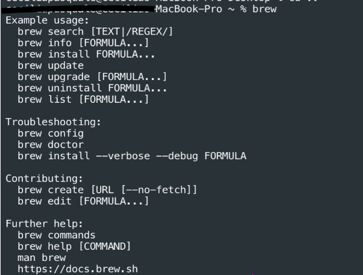
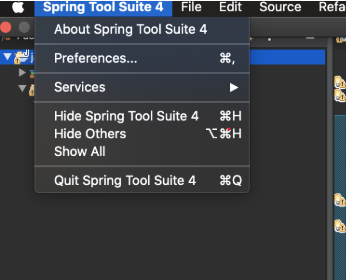
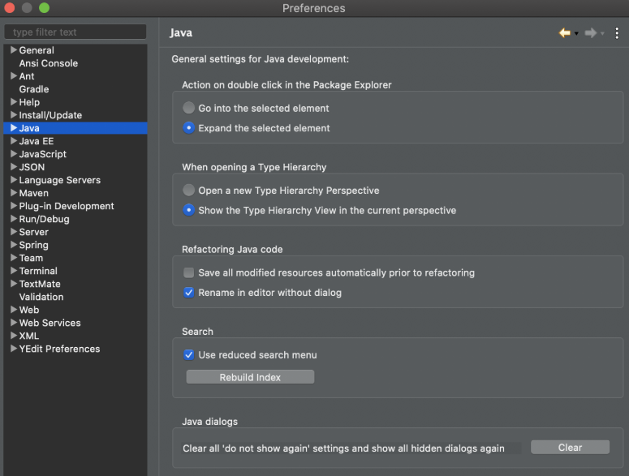
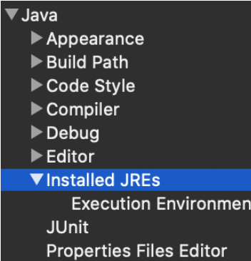
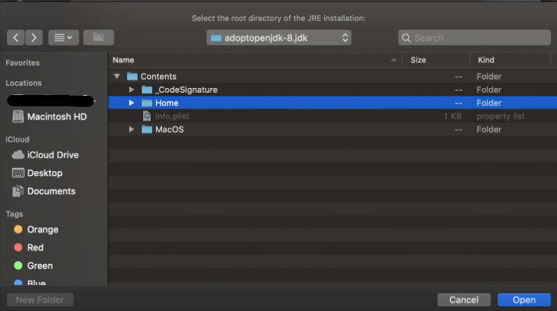
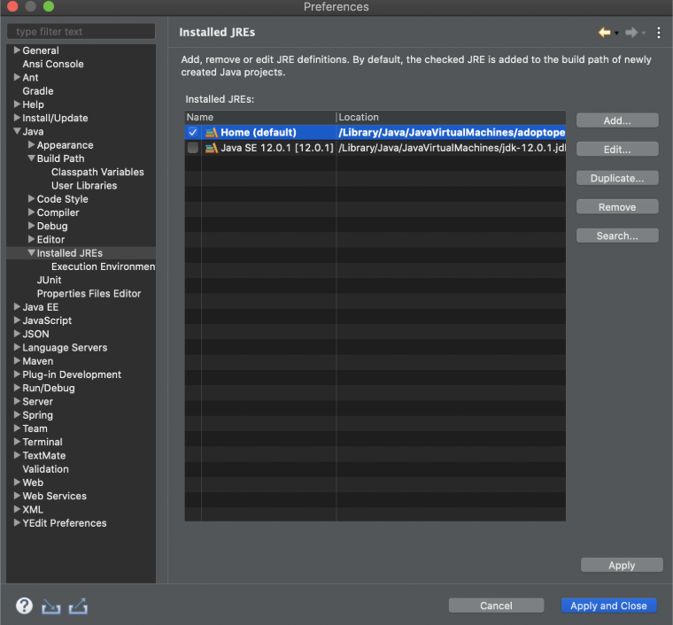

# mac-install-guide

## Install Using A Package Manager

A *package manager* is a command line tool that allows you to install and manage software. You can use a package manager to install all of the software listed here.

The package manager that we'll be using for this guide is called Homebrew. It's a command-line installer for MacOS, which means that you'll have to be running a macOS in order to use. If you are using a Windows machine the guide [here](https://github.com/210614-JavaFS/Enviroment-Setup) should be much more useful for you. The examples provided here are utilizing macvscodeOS Catalina version 10.15.5.

## Step 1: Install Homebrew


Open your terminal and type <code>brew</code>.

The result should look like the following:



## Step 2: Install Git

With Homebrew installed, you are now ready to install Git. Open a terminal window and enter <code>brew install git</code>

To verify that Git is installed on your system, type <code>git --version</code>

## Step 3: Install JDK 8

Run the following commands in your terminal:
```code
brew untap adoptopenjdk/openjdk
brew untap caskroom/versions
brew cleanup
```

Once <code>cleanup</code> is finished, type the following command into the terminal:

<code>brew cask install adoptopenjdk/openjdk/adoptopenjdk8</code>


### Configure your Environment Variables
#### A. Mac OSX 10.5 or later:
In Mac OSX 10.5 or later, Apple recommends to set the <code>$JAVA_HOME</code> variable to <code>/usr/libexec/java_home</code>, just export <code>$JAVA_HOME</code> in file <code>~/. bash_profile</code> or ~<code>/.profile</code>.

```code
$ vim .bash_profile

export JAVA_HOME=$(/usr/libexec/java_home)

$ source .bash_profile

$ echo $JAVA_HOME
/Library/Java/JavaVirtualMachines/1.8.0.jdk/Contents/Home
```

#### B. Older Mac OSX:
For older Mac OSX, the <code>/usr/libexec/java_home</code> doesn’t exist, so, you should set <code>JAVA_HOME</code> to the fixed path:

```code
$ vim .bash_profile

export JAVA_HOME=/System/Library/Java/JavaVirtualMachines/1.8.0.jdk/Contents/Home

$ source .bash_profile

$ echo $JAVA_HOME
/System/Library/Java/JavaVirtualMachines/1.8.0.jdk/Contents/Home
```


## Step 4:  Install Spring Tool Suite 4

Navigate to https://spring.io/tools and download the appropriate version of Spring Tool.

If your installation was successful, you should now be able to search for <code>Spring Tool Suite</code> in your spotlight search using <code>cmd+space</code>.

Once downloaded, open Spring Tool and navigate to your preferences. 



1. Select **Java** in the left panel of your preferences and click on **Installed JREs**.








2. Click **add** on the right side of your preferences menu and select **Standard VM**.


3. Click the Directory button to navigate to your installed Java versions. 
    
    * When the finder window opens select your HD.
    * Select **Library** and look for **Java** listed below.
    * Click on **Java** and navigate into **JavaVirtualMachines** where you should see an <code>adoptopenjdk-8.jdk</code>.
    * Select this JDK and navigate to **Contents** and then **Home**.
    * With home highlighted, click **Open**. 



You should now see this:



## Step 5: Install Maven

To install **Maven** with Homebrew, open your terminal window and run: <code>brew install maven</code> 

Once the download is complete, verify the installation by running: <code>mvn -v</code>

## Step 6: Install DBeaver

Navigate to https://dbeaver.io/download/ and download the appropriate version of DBeaver.

If your installation was successful, you should now be able to search for "dbeaver" in your spotlight with <code>cmd + space</code>.

## Step 7: Install Apache Tomcat 9
Follow these [instructions](https://medium.com/@jeongwhanchoi/how-to-install-apache-tomcat-on-mac-os-x-605b1cb55252). Make sure to install the latest version of Tomcat 9. 

## Step 8: Install Postman

The following is the single command required to install Postman on macOS using Homebrew:

<code>brew cask install postman</code>

## Step 9: Install Visual Studio Code

The following is the single command required to install Visual Studio Code on macOS using Homebrew:

<code>brew cask install visual-studio-code</code>

If you encounter problems and unable to install any of these applications with homebrew, refer to the manual download section of the [Environment Setup Guide](https://github.com/210614-JavaFS/Enviroment-Setup) to install it manually instead. 


